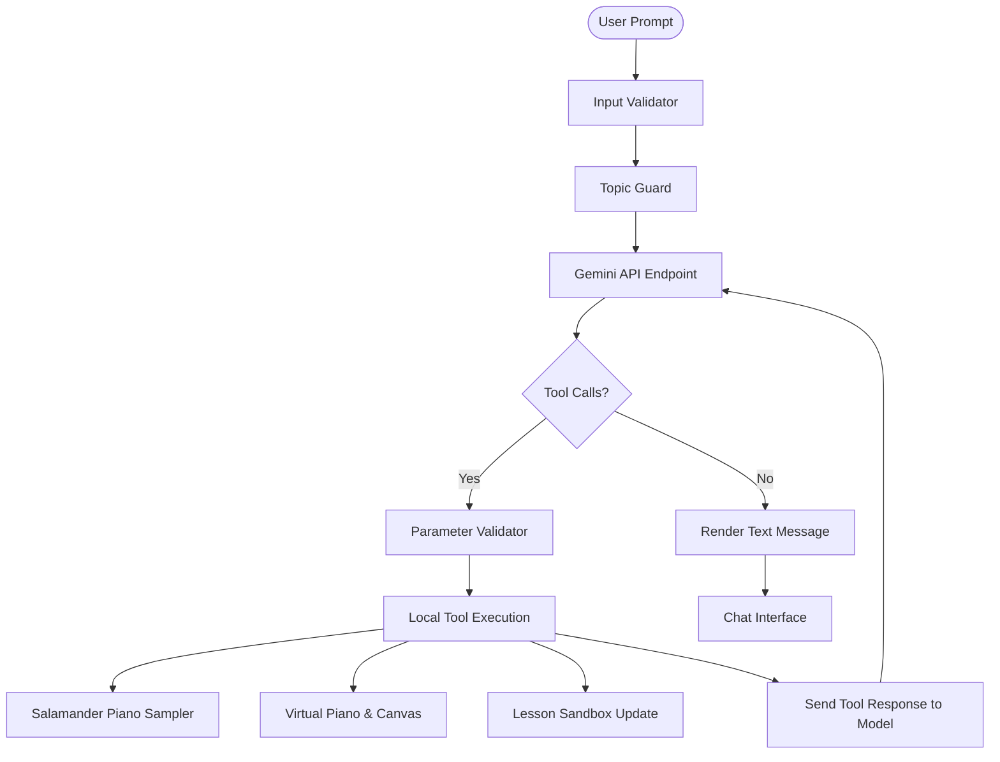

# VibeMuse: AI-Powered Synesthetic Music Tutor 🎵

VibeMuse is an interactive, web-based AI Music Tutor ("Sensei") that helps students learn music theory, practice chords and scales, explore songwriting, and build ear-training skills. It features a fully interactive virtual piano, a high-performance HTML5 Canvas synesthetic particle visualizer, and a concert-grade grand piano sampler.

VibeMuse is built as a capstone project for the **AI Agents: Intensive Vibe Coding** challenge.

---

## 🚀 Key Features

- **AI Music Sensei:** A Gemini-powered conversational music tutor that guides students through theory lessons, exercises, and songwriting sessions.
- **Concert-Grade Grand Piano:** Employs a multi-sampled Yamaha C5 Grand Piano (Salamander Grand Piano library) with custom sustain dynamics, allowing you to hold notes as long as a key is pressed.
- **Event-Driven Tool Loop:** Intercepts agent instructions to play notes, sound chords, arpeggiate chord progressions, highlight scale overlays, and dynamically update the student profile and sandbox lessons.
- **Active Lesson Sandbox:** A dedicated practice widget where the AI agent dynamically places clickable chord badges for students to trigger manually.
- **Synesthetic Particle Visualizer:** Maps note frequencies to colors (pitch-to-hue) and spawns physical particle animations on an HTML5 canvas upon key press.
- **Harmony Guard Safety Suite:** Real-time client-side security validators that enforce safety and contain API costs before messages reach the Gemini endpoints.

---

## 🧬 Capstone Concepts Implemented

VibeMuse integrates **three core concepts** from the AI Agents curriculum:

### 1. Agent & Multi-Agent Systems (ADK)
- Interacts directly with the Google Gemini REST API using the model's function-calling tool capability.
- Employs a **recursive execution loop** in `app.js` that catches tool requests, plays audio, updates UI properties, sends feedback objects back to the model, and loops until the model completes its response.
- Exposes **8 native tools** for agent execution:
  - `play_note` / `play_chord` / `play_chord_progression` — Interactive audio playback.
  - `show_scale` / `clear_piano_highlights` — Key visualizer controllers.
  - `update_lesson_sandbox` / `update_student_profile` — Workspace state synchronization.
  - `run_harmony_guard_check` — Safety check reporting.

### 2. Security & Guardrails (Harmony Guard)
- **Input Validator:** Scans user text for prompt injection keywords (`ignore previous instructions`, `jailbreak`, etc.) and blocks queries locally.
- **Topic Guard:** Compares words against a music-related semantic dictionary, filtering out off-topic requests (e.g. math, coding, cooking) locally.
- **Tool Parameter Validator:** Sanitizes arguments passed by the model (clamps octave ranges to `2-7`, BPM to `40-220`, and note naming formats) before passing them to the Web Audio engine.
- **Diagnostic Suite:** Contains an automated diagnostic runner (triggered by typing `/test-guardrails` in the chat) that runs test cases and prints a safety report card.

### 3. Deployability & Portability
- Bundled as a zero-dependency frontend bundle (`app.js`, `index.css`, `index.html`) optimized for static web hosting.
- Utilizes `localStorage` to securely store user settings, conversation history, student badges, and API keys. No backend or database is required.
- Fully compatible with the `file://` protocol, allowing offline playability via local browser execution.

---

## 🛠️ System Architecture

---

## ⚡ Setup & Installation

VibeMuse runs directly in any modern web browser:
1. Clone this repository or download the source files.
2. Open `index.html` in your web browser.
3. Click the **Settings (⚙️)** icon in the top right.
4. Input your **Gemini API Key** (get a free key at [Google AI Studio](https://aistudio.google.com/)).
5. Click **Save Settings** to begin.

---

## 🧪 Safety Diagnostics

To verify the **Harmony Guard** security validators:
1. Open the VibeMuse chat.
2. Type `/test-guardrails` and press Enter.
3. The automated test suite will run locally and display a detailed test report showing pass/fail status for prompt injections, off-topic prompts, and parameter violations directly in the chat history.
